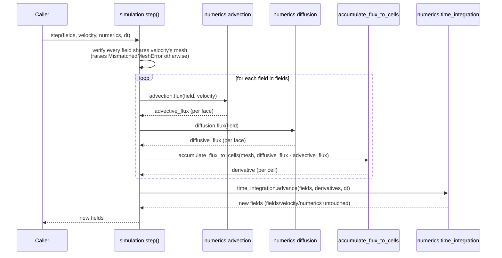
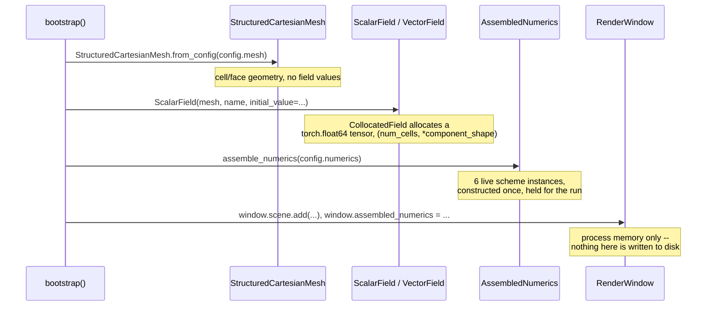
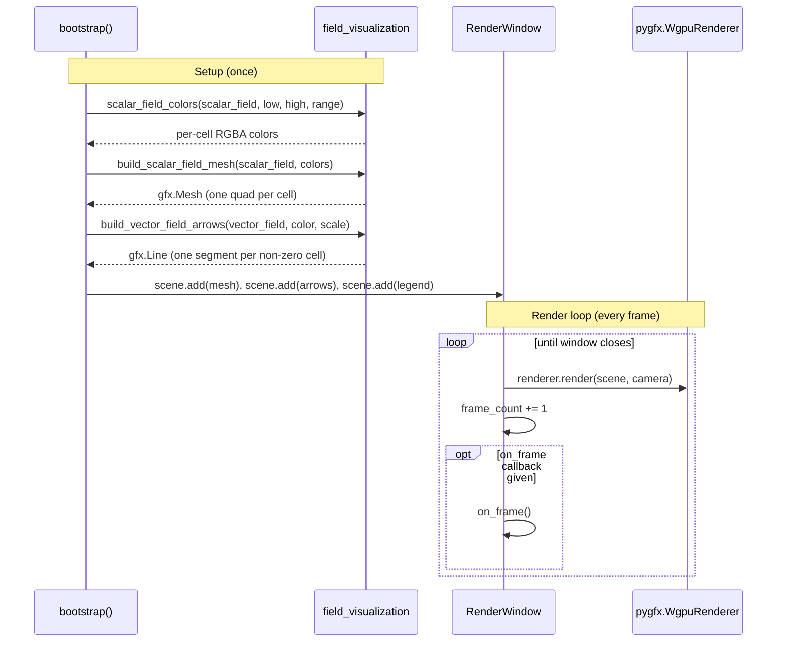

# Runtime Sequences

`overview.md` answers "what are the pieces." `engine.md` answers "why is
each layer independently replaceable." Neither answers "in what order do
things actually happen when PyFlow runs" -- that is this document's only
job. Read it after `overview.md`, alongside `engine.md` and `rendering.md`
for the pieces each sequence below moves through.

Four sequences, each grounded directly in the module that implements it,
not re-derived from general engine-design knowledge. Where a sequence
covers something not yet built, that subsection is marked **Planned** and
says so plainly, rather than describing a mechanism that doesn't exist yet
as though it did.

---

## 1. Simulation Setup

What happens between a user running `pyflow run` (or calling `bootstrap()`
directly, PyFlow's actual public API -- see `overview.md`) and a window
appearing on screen. Matches `src/pyflow/bootstrap.py`'s `bootstrap()`
exactly, including the two orderings that matter: `assemble_numerics` runs
on every call regardless of whether the run needs it yet, and
`fit_camera_to_bounds` must run before `apply_camera_config` so configured
zoom/pan apply on top of the base framing, not the other way round.


Grounded in `bootstrap.py:150-220`. `RenderWindow` itself constructs
nothing simulation-related (`rendering/CLAUDE.md`'s "no simulation
content" scope) -- every arrow into `Assembly`/`Mesh`/`Viz` above is
`bootstrap()`'s own composition, not something `RenderWindow` does on its
own.

---

## 2. Timestep Loop Operations

### Built today

`engine/simulation.py`'s `step()` is the mechanism `engine.md`'s Flux
entry describes ("jointly compute[d]" by the Advection/Diffusion/
Gradient/Divergence interfaces) but assigns to no module. It is real,
unit-tested (`tests/unit/test_simulation.py`), and callable directly --
the sequence below is exactly what it does.



The advective term is *subtracted* and the diffusive term *added* when
building each cell's derivative -- `step()`'s own docstring resolves this
directly from the FVM conservation equation
(`docs/handbook/numerical-methods/fvm.md`): `d/dt \int_V \rho\phi\,dV =
-\oint_{\partial V} \rho\phi\mathbf{u}\cdot\mathbf{n}\,dA + \oint_{\partial V}
\Gamma\nabla\phi\cdot\mathbf{n}\,dA + \text{source}` -- quoted directly
from `simulation.py`'s own `step()` docstring, not re-derived.
`accumulate_flux_to_cells`
is the discrete Gauss theorem: a face's owner cell sees its value with
sign `+1`, its neighbour (if any) with sign `-1`
(`Mesh.face_normal`'s own canonical direction), summed and divided by
cell volume. `step()` never branches on `Mesh.is_boundary_face` anywhere
in its own code -- a concrete Advection/Diffusion scheme is constructed
with the boundary conditions it needs and handles a boundary face itself,
so the orchestrator above doesn't need to know which faces are boundary
faces at all.

Every call into `Adv`/`Diff`/`TI` above goes through the *contract*, never
a concrete scheme by name -- `engine.md`'s Core Principle ("the
timestepper doesn't care which one it has") is what makes this sequence
identical regardless of which of the six `adr/ADR-003-modular-numerical-
strategies.md` components `assemble_numerics` resolved. See `engine.md`
for why that's true and what it buys; this document only shows that it's
true, in sequence.

### Built today: driving `step()` from a live run

**Built 2026-08-28, TASK-030 -- Stage 4's own Passive Scalar Transport
golden demo.** `bootstrap.py`'s `_add_passive_scalar_transport` is the
caller Section 2's earlier "Planned" note above described in advance: it
builds the transported field and prescribed velocity from
`config.simulation`, renders the first frame, and returns a closure that
`RenderWindow.run(on_frame=...)` (`rendering/window.py`) calls once per
rendered frame thereafter -- the exact seam that subsection's own
docstring anticipated ("exactly what a future real-time simulation loop
will need").

```mermaid
sequenceDiagram
    participant bootstrap as bootstrap()
    participant Add as _add_passive_scalar_transport
    participant Window as RenderWindow.run()
    participant Advance as on_frame closure
    participant Step as simulation.step()
    participant Viz as field_visualization

    bootstrap->>Add: _add_passive_scalar_transport(window, mesh, config)
    Add->>Viz: build_scalar_field_mesh(scalar_field, colors)
    Viz-->>Add: gfx.Mesh (frame 0)
    Add->>Window: scene.add(rendered_object)
    Add-->>bootstrap: on_frame closure
    bootstrap->>Window: window.run(max_frames, on_frame)
    loop each rendered frame
        Window->>Advance: on_frame()
        Advance->>Step: step(state, velocity, numerics, dt)
        Step-->>Advance: new state
        Advance->>Window: simulation_fields = new state
        Advance->>Viz: scalar_field_colors(new tracer, low, high, range)
        Viz-->>Advance: per-cell RGBA colors
        Advance->>Window: scene.remove(old object); scene.add(new object)
    end
```

**Each frame's rendered `gfx.Mesh` is rebuilt from scratch, not mutated
in place.** `build_scalar_field_mesh`/`scalar_field_colors` are already
proven correct (TASK-017); an in-place colour-buffer mutation
(`geometry.colors.data[:] = ...`) would be new, unverified pygfx-API
surface for a small win on a small demo mesh -- a deliberate, recorded
deferral (`docs/planning/roadmap.md` TASK-030's own Design decision), not
an oversight. `gfx.Scene.remove` was verified directly (add then remove
leaves `len(scene.children) == 0`) before being relied on.

`RenderWindow.simulation_fields` is what lets a caller -- the golden
demo's own regression test, most directly -- read back the real field
state a rendered frame came from, the same "`bootstrap()` populates it,
`RenderWindow` itself holds no simulation content" shape
`assembled_numerics` already established (Section 3, below).

---

## 3. Data Flow: Where State Lives

### Built today

Simulation state exists only as objects held in process memory for the
lifetime of one `bootstrap()` call -- there is nothing else to a "data
flow" today beyond what's constructed and where it's referenced from.



Grounded in `collocated_field.py` (`CollocatedField.__init__` allocates
the tensor) and `assembly.py` (`AssembledNumerics` construction). Closing
the window or exiting the process discards all of it -- verified by
reading `src/pyflow` for any save/load/checkpoint/persistence code: there
is none. The only thing PyFlow reads or writes on disk today is YAML
*configuration* (`configuration/loader.py`), which is input, not
simulation output.

### Planned: checkpointing

**Not built yet, and not an open design question either.**
`docs/planning/roadmap.md`'s TASK-034 entry already records the intended
shape, raised by the maintainer while scoping TASK-013's live zoom/pan and
deliberately deferred until a real timestepping loop exists to pause:

> checkpoint-based -- periodic full-state snapshots plus deterministic
> replay between them, not storing every frame, which gets expensive fast
> for field-rich simulations

This leans on the determinism `docs/implementation/golden-demos.md`'s
Definition of Done already requires of every demo: replay-from-checkpoint
is only cheap if re-running the same steps reproduces the same state,
which is a standing requirement already, not a new one checkpointing would
add. Update this subsection with the real sequence once **TASK-034**
lands -- a note on that task's own roadmap entry asks for the same thing
in the same change.

---

## 4. Rendering Pipeline

How mesh/field data becomes pixels. Two phases, and the boundary between
them matters: geometry is built and added to the scene *once*, during
setup; the render loop then redraws the same scene every frame regardless
of whether its contents changed.



Grounded in `field_visualization.py` (the four builder functions) and
`window.py`'s `_draw`/`run` (the render loop itself). Every function in
`field_visualization.py` takes a `Field`, never a `Field` plus a separate
`Mesh` argument -- a `Field` already carries its own mesh
(`field.mesh`), so there is no second reference for the two to drift out
of sync (`rendering/CLAUDE.md`'s Stage 2 exit-audit rule). See
`rendering.md`'s "The Layering" section for how the canvas backend
(`glfw` vs `offscreen`) is selected underneath `RenderWindow` -- this
diagram is unaffected by that choice either way.

**The `on_frame` hook drawn above is the same seam Section 2's Planned
subsection names.** Today its only real caller is the interactive-window
test suite (`tests/integration/test_interactive_window.py`), which
mutates `scene` between frames to prove distinct frames are actually
presented. Once TASK-030 wires a live timestep loop through it
(Section 2), this is also where updated field data will need to reach the
scene -- rebuilding (or updating in place) the `gfx.Mesh`/`gfx.Line`
objects this section builds, once per frame instead of once at setup.
Update this note alongside Section 2's when that lands.

---

## Maintenance

Written 2026-08-27, grounded directly in `src/pyflow/bootstrap.py`,
`src/pyflow/engine/simulation.py`, `src/pyflow/rendering/window.py`,
`src/pyflow/rendering/field_visualization.py`,
`src/pyflow/engine/collocated_field.py`, and the existing `engine.md`/
`overview.md`/`rendering.md` and their `CLAUDE.md` companions -- not
re-derived from general engine-design knowledge.

Two subsections are deliberately marked **Planned** rather than omitted or
stated as fact: Section 2's live-loop wiring and Section 3's checkpointing.
Both are anchored to the specific roadmap task that will build them
(TASK-030, TASK-034) rather than left as an open-ended "future work," and
both of those tasks' own `docs/planning/roadmap.md` entries carry a note
asking for this document to be updated in the same change that lands them
-- so the update is findable from the roadmap, not only from this
document's own memory. If either lands and this file wasn't updated in
the same change, that is exactly the kind of drift `docs/practices.md`'s
Blast Radius rule exists to catch: grep this file's own TASK-030/TASK-034
mentions the next time either task is touched.
