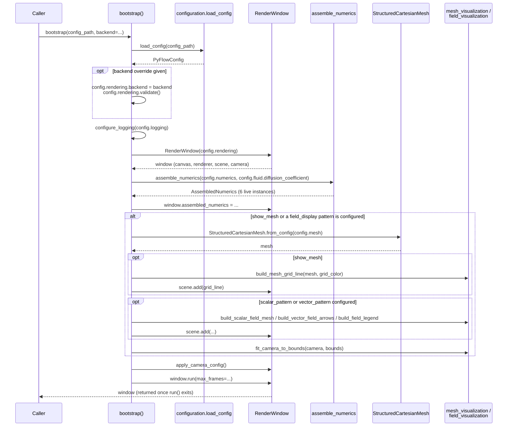
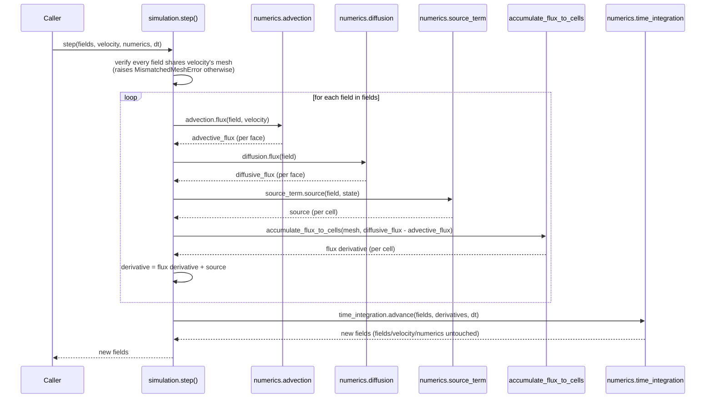
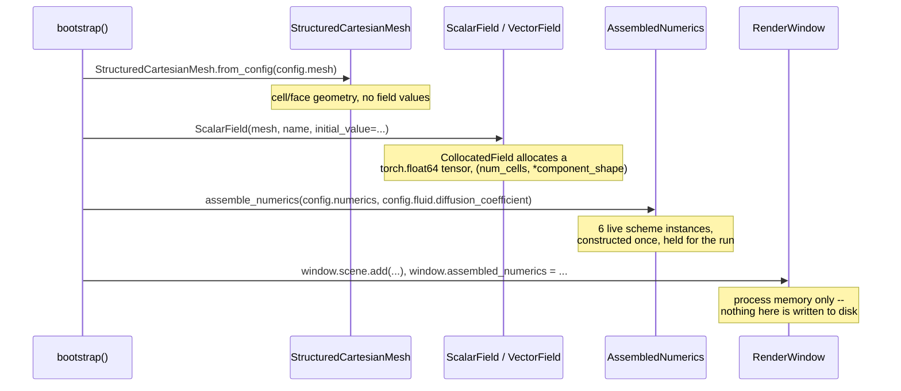
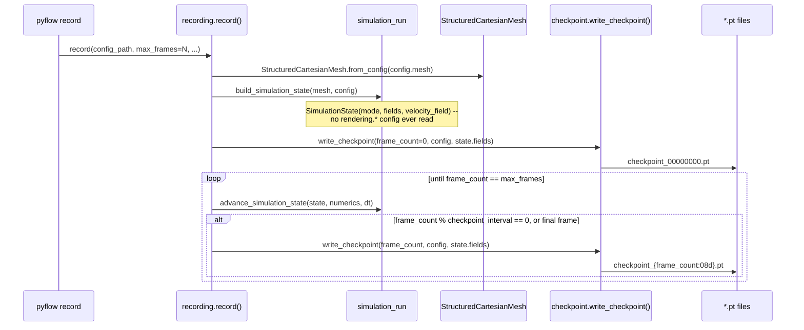
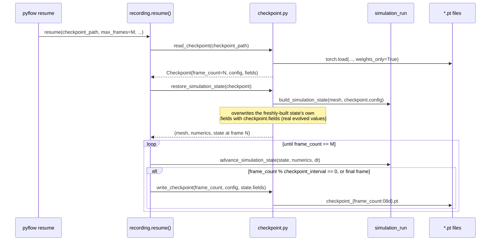
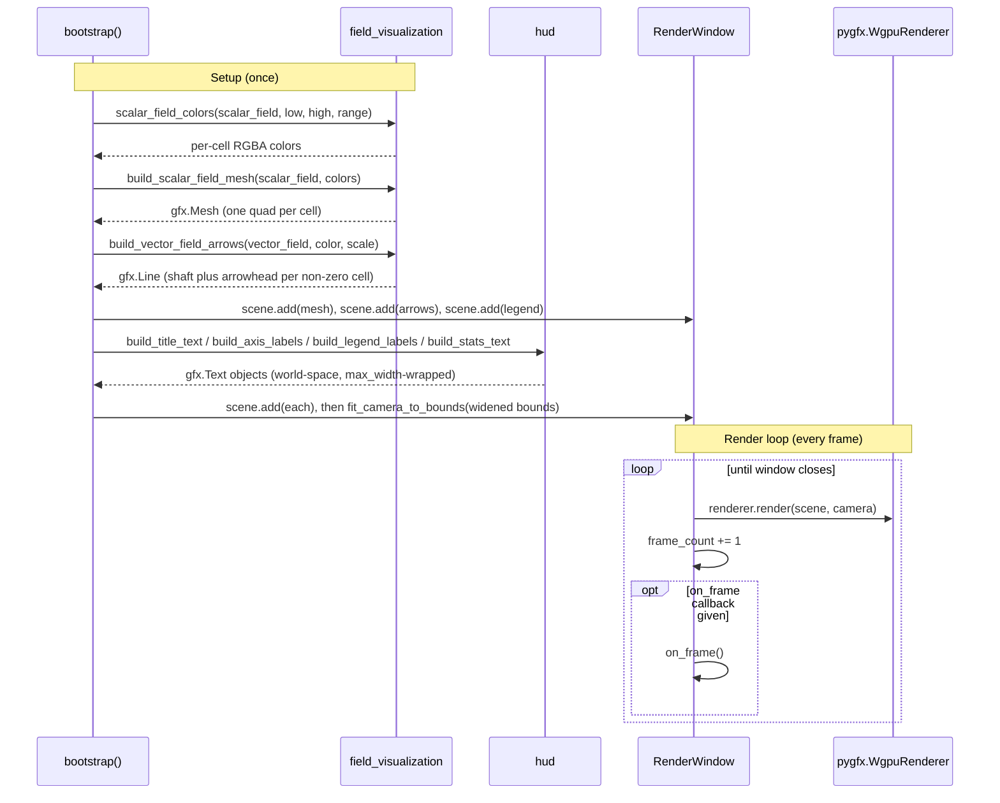

# Runtime Sequences

Checked-by: stage-boundary

Three consecutive stage audits found a defect here. Re-read it whole.

`overview.md` answers "what are the pieces." `engine.md` answers "why is
each layer independently replaceable." Neither answers "in what order do
things actually happen when PyFlow runs" -- that is this document's only
job. Read it after `overview.md`, alongside `engine.md` and `rendering.md`
for the pieces each sequence below moves through.

Four sequences, each grounded directly in the module that implements it,
not re-derived from general engine-design knowledge. Where a sequence
covers something not yet built, that subsection is marked **Planned** and
says so plainly, rather than describing a mechanism that doesn't exist yet
as though it did.

---

## 1. Simulation Setup

What happens between a user running `pyflow run` (or calling `bootstrap()`
directly, PyFlow's actual public API -- see `overview.md`) and a window
appearing on screen. Matches `src/pyflow/bootstrap.py`'s `bootstrap()`
exactly, including the two orderings that matter: `assemble_numerics` runs
on every call regardless of whether the run needs it yet, and
`fit_camera_to_bounds` must run before `apply_camera_config` so configured
zoom/pan apply on top of the base framing, not the other way round.



Grounded in `bootstrap.py:150-220`. `RenderWindow` itself constructs
nothing simulation-related (`rendering/CLAUDE.md`'s "no simulation
content" scope) -- every arrow into `Assembly`/`Mesh`/`Viz` above is
`bootstrap()`'s own composition, not something `RenderWindow` does on its
own.

---

## 2. Timestep Loop Operations

### Built today

`engine/simulation.py`'s `step()` is the mechanism `engine.md`'s Flux
entry describes ("jointly compute[d]" by the Advection/Diffusion/
Gradient/Divergence interfaces) but assigns to no module. It is real,
unit-tested (`tests/unit/test_simulation.py`), and callable directly --
the sequence below is exactly what it does.



The advective term is *subtracted* and the diffusive term *added* when
building each cell's derivative -- `step()`'s own docstring resolves this
directly from the FVM conservation equation
(`docs/handbook/numerical-methods/fvm.md`): `d/dt \int_V \rho\phi\,dV =
-\oint_{\partial V} \rho\phi\mathbf{u}\cdot\mathbf{n}\,dA + \oint_{\partial V}
\Gamma\nabla\phi\cdot\mathbf{n}\,dA + \text{source}` -- quoted directly
from `simulation.py`'s own `step()` docstring, not re-derived.

**The `+ source` on the end of that equation became a real call in
Stage 6** (TASK-035, 2026-08-30): `numerics.source_term.source(field,
state)`, added to every field's own derivative, is where a Boussinesq
body force reaches momentum (`src/pyflow/physics/buoyancy.py`,
`adr/ADR-010-source-term-state.md`). It is passed the whole `state`
this evaluation is already computing over, not only the field being
advanced, precisely so a term can read a *different* field's own
current value than the one it contributes to -- which is what a
buoyancy term does, reading temperature and contributing to
`velocity.1`. **The diagram above did not show this call until
2026-08-31, when this stage's exit audit found it**: the same defect,
in the same document, that the *Stage 5* exit audit found and wrote
`docs/practices.md`'s fourth grep against ("for each capability a stage
adds, name the document that would have to describe it if it had
existed from the start"). A run naming no source term
(`numerics.source_term: "none"`, the default) gets an exact zero from
that call and advances identically to before it existed.

`accumulate_flux_to_cells`
is the discrete Gauss theorem: a face's owner cell sees its value with
sign `+1`, its neighbour (if any) with sign `-1`
(`Mesh.face_normal`'s own canonical direction), summed and divided by
cell volume. `step()` never branches on `Mesh.is_boundary_face` anywhere
in its own code -- a concrete Advection/Diffusion scheme is constructed
with the boundary conditions it needs and handles a boundary face itself,
so the orchestrator above doesn't need to know which faces are boundary
faces at all.

Every call into `Adv`/`Diff`/`TI` above goes through the *contract*, never
a concrete scheme by name -- `engine.md`'s Core Principle ("the
timestepper doesn't care which one it has") is what makes this sequence
identical regardless of which of the six `adr/ADR-003-modular-numerical-
strategies.md` components `assemble_numerics` resolved. See `engine.md`
for why that's true and what it buys; this document only shows that it's
true, in sequence.

### Built today: driving `step()` from a live run

**Built 2026-08-28, TASK-030 -- Stage 4's own Passive Scalar Transport
golden demo.** `bootstrap.py`'s `_add_declared_field_transport` is the
caller Section 2's earlier "Planned" note above described in advance: it
builds one `ScalarField` per `config.fields` declaration and a
prescribed velocity from `config.simulation`, renders the first frame,
and returns a closure that `RenderWindow.run(on_frame=...)`
(`rendering/window.py`) calls once per rendered frame thereafter -- the
exact seam that subsection's own docstring anticipated ("exactly what a
future real-time simulation loop will need").

**This function was called `_add_passive_scalar_transport`, and
transported exactly one field hardcoded as `"tracer"`, until TASK-042
(Stage 6, 2026-08-30) generalised it to `config.fields`' own
declarations.** This document still used the old name in four places --
including as a participant in the diagram below -- until 2026-08-31,
when this stage's exit audit grepped for it: `make check-references`
resolves repository *paths* named in prose, not function names, so a
renamed helper goes stale here behind a green gate.

**When `simulation.velocity_solved` is set, this same closure calls
`navier_stokes_step` rather than the `step()` shown below** (Stage 5
exit audit, 2026-08-29) -- Section 2's third subsection is that
sequence. The diagram here is the prescribed-velocity path, which is
what the demo it was drawn for configures.

```mermaid
sequenceDiagram
    participant bootstrap as bootstrap()
    participant Add as _add_declared_field_transport
    participant Window as RenderWindow.run()
    participant Advance as advance closure
    participant Hud as HUD update closure
    participant Step as simulation.step()
    participant Viz as field_visualization

    bootstrap->>Add: _add_declared_field_transport(window, mesh, config)
    Add->>Viz: build_scalar_field_mesh(scalar_field, colors)
    Viz-->>Add: gfx.Mesh (frame 0)
    Add->>Window: scene.add(rendered_object)
    Add-->>bootstrap: advance closure
    bootstrap->>bootstrap: _add_hud(...) -> HUD update closure
    bootstrap->>bootstrap: on_frame = advance, then HUD update
    bootstrap->>Window: window.run(max_frames, on_frame)
    loop each rendered frame
        Window->>Advance: on_frame() -- advance half
        Advance->>Step: step(state, velocity, numerics, dt)
        Step-->>Advance: new state
        Advance->>Window: simulation_fields = new state
        Advance->>Viz: scalar_field_colors(new render_field, low, high, range)
        Viz-->>Advance: per-cell RGBA colors
        Advance->>Window: scene.remove(old object); scene.add(new object)
        Window->>Hud: on_frame() -- HUD half
        Hud->>Window: stats_object.set_text(step N, t = ...)
    end
```

**`on_frame` is two closures composed, and the order is load-bearing**
(Stage 7, Rendering Annotations, TASK-044; drawn here 2026-09-03 by that
stage's exit audit, which found this section describing the pre-Stage-7
single closure). `bootstrap()` runs the simulation-advance closure
first and the HUD-update closure second, because `RenderWindow._draw`
increments `frame_count` *before* firing `on_frame`: by the time
`_stats_lines` reads it, the state that will be shown starting the next
rendered frame has been advanced exactly `frame_count` times, so
`elapsed = frame_count * timestep` describes what a viewer is actually
looking at. Reversing the two would label each frame with the previous
frame's time. `bootstrap.py`'s `_stats_lines` docstring carries the full
trace through `window.py`'s own increment-then-callback order.

**A static run composes nothing**: `_add_hud` returns an update closure
only when the run is live-stepping *and* `rendering.show_stats` is on,
since a static run's stats never change.

**Each frame's rendered `gfx.Mesh` is rebuilt from scratch, not mutated
in place.** `build_scalar_field_mesh`/`scalar_field_colors` are already
proven correct (TASK-017); an in-place colour-buffer mutation
(`geometry.colors.data[:] = ...`) would be new, unverified pygfx-API
surface for a small win on a small demo mesh -- a deliberate, recorded
deferral (`docs/planning/roadmap.md` TASK-030's own Design decision), not
an oversight. `gfx.Scene.remove` was verified directly (add then remove
leaves `len(scene.children) == 0`) before being relied on.

`RenderWindow.simulation_fields` is what lets a caller -- the golden
demo's own regression test, most directly -- read back the real field
state a rendered frame came from, the same "`bootstrap()` populates it,
`RenderWindow` itself holds no simulation content" shape
`assembled_numerics` already established (Section 3, below).

### Built today: one incompressible Navier-Stokes timestep

**Built 2026-08-29, TASK-034 -- Stage 5's own assembled timestep, and
the sequence the two above are no longer the whole of.** Everything
before this subsection describes `step()`, which advances transported
fields through a velocity it treats as external input. A run that
*solves* for velocity (`simulation.velocity_solved: true`) does not call
`step()` from `on_frame` at all -- it calls
`simulation.navier_stokes_step`, which calls `step()` as its own
momentum predictor and then corrects the result.

**Added by the Stage 5 exit audit, not by TASK-034 itself.** This
document's only stated job is "in what order do things actually happen
when PyFlow runs", and for a full day after the coupled solve landed it
contained no mention of pressure, predictor or corrector -- the exact
drift its own Maintenance section below asks a reader to grep for.

```mermaid
sequenceDiagram
    participant Caller
    participant NS as simulation.navier_stokes_step()
    participant Step as simulation.step()
    participant PC as numerics.pressure_coupling
    participant LS as numerics.linear_solver

    Caller->>NS: navier_stokes_step(fields, velocity_field_name, numerics, dt)
    NS->>NS: assemble u/v components into a VectorField
    Note over NS,Step: Predictor -- momentum advanced with no pressure term
    NS->>Step: step(fields, current_velocity, numerics, dt)
    Step-->>NS: predicted fields (velocity components and any scalars alike)
    NS->>NS: reassemble the predicted components: provisional velocity
    Note over NS,LS: Corrector -- a loop, not a single pass (TASK-033)
    NS->>PC: correct(provisional_velocity, dt)
    loop until max divergence <= tolerance, else raise
        PC->>PC: Rhie-Chow-corrected divergence, recorded in last_divergence_history
        PC->>LS: solve(poisson_matrix, -divergence / dt)
        LS-->>PC: pressure correction
        PC->>PC: pressure += correction; velocity -= dt * grad(correction)
    end
    PC-->>NS: (corrected_velocity, pressure)
    NS-->>Caller: NavierStokesStepResult(fields, provisional, corrected, pressure)
```

**Three things this sequence makes visible that prose does not.**
`step()` is reused unchanged as the momentum predictor -- velocity's own
components go through the same `AdvectionScheme`/`DiffusionScheme`/
`TimeIntegrator` path a transported scalar does, which is Stage 5
Completion Criterion 1's whole claim. The corrector is a *loop* whose
per-pass divergence is recorded, not a single correction (`PISO`,
genuinely multi-pass since TASK-033). And `numerics.linear_solver`
reaches the timestep only through `numerics.pressure_coupling` -- never
called directly by `navier_stokes_step`, which is why proving the
*configured* solver is the one that runs needed its own substitution
scenario (`tests/features/navier_stokes_timestep.feature`, added by that
stage's exit audit).

Pressure is never a member of `fields`: `step()` raises
`PressureFieldTransportError` if a `PressureField` appears there, and
`navier_stokes_step` returns the solved pressure alongside the fields
rather than among them. That is Criterion 2's "solved from the
constraint, not transported", expressed structurally.

The live-run wiring is `bootstrap.py`'s `_add_solved_velocity_rendering`
-- the same `on_frame` seam `_add_declared_field_transport` attaches to
above, calling `navier_stokes_step` once per rendered frame and redrawing
the corrected velocity as arrows (`examples/golden-demos/
lid_driven_cavity.yaml`).

---

## 3. Data Flow: Where State Lives

### Built today

Simulation state exists only as objects held in process memory for the
lifetime of one `bootstrap()` call -- there is nothing else to a "data
flow" today beyond what's constructed and where it's referenced from.



Grounded in `collocated_field.py` (`CollocatedField.__init__` allocates
the tensor) and `assembly.py` (`AssembledNumerics` construction). Closing
the window or exiting the process discards all of it -- verified by
reading `src/pyflow` for any save/load/checkpoint/persistence code: there
is none. The only thing PyFlow reads or writes on disk today is YAML
*configuration* (`configuration/loader.py`), which is input, not
simulation output.

### Built today: headless checkpointing (`pyflow record`/`pyflow resume`)

**Built 2026-09-07, TASK-045** -- the sequence below, replacing the
`Planned` placeholder this subsection carried since TASK-034 (2026-08-29,
Stage 5 exit audit) deliberately declined to build it. Recording and
rendering are two disjoint entry points from here on, not one path with
a flag: `pyflow record` never constructs a `RenderWindow` at all, and
`pyflow run` never writes a checkpoint. `src/pyflow/simulation_run.py`
is what makes both possible without duplicating the stepping logic --
see that module's own docstring, and `src/pyflow/CLAUDE.md`'s entry for
why it sits at the package root.



**A checkpoint file is fully self-contained.** `write_checkpoint`
`torch.save`s one dict per frame -- `schema_version`, `frame_count`, the
whole `PyFlowConfig` as `dataclasses.asdict(config)` (not a pickled
instance: `torch.load(weights_only=True)` cannot load one, and
`config_from_dict` in `configuration/loader.py` already validates a
plain dict identically to a loaded YAML file), and every field's tensor
keyed by name. `PressureField` never appears in this dict -- it is a
`navier_stokes_step` return value, never fed back into the state that
gets advanced or checkpointed (`engine/CLAUDE.md`'s own `PISO` entry),
so no field-type tag is needed: every value here is a plain
`(num_cells,)` tensor. No RNG state and no device metadata either --
grepping this codebase for `torch.rand`/`random.`/`.cuda(` finds
nothing, so nothing here is non-deterministic to begin with.

**Resuming needs more than the tensors, and `checkpoint.py` is where
that gap is closed.** A checkpoint's `fields` dict alone cannot rebuild
a "passive" mode `SimulationState` -- its prescribed `velocity_field` is
never checkpointed, since it is constant by construction and would only
be a second, redundant record of `config.simulation.velocity_pattern`.
`restore_simulation_state(checkpoint)` calls `build_simulation_state`
again (from the checkpoint's own embedded config) to reconstruct that
structure, then overwrites `.fields` with the checkpoint's real evolved
values -- structure from the config, state from the checkpoint, never
the other way round. `tests/unit/test_recording_determinism.py` proves
the round trip is bit-identical to an uninterrupted run to the same
frame (`rtol=0, atol=0`), confirmed to have teeth by deliberately
corrupting `restore_simulation_state` and watching the test fail before
trusting it green.

**`pyflow resume`, added the same task at a user's direct request, is
`restore_simulation_state` given a CLI a second process can actually
run** -- until it existed, "how does a second run ingest a checkpoint"
had no answer past a private Python function.



**Shares its checkpoint-writing policy with `record`, not a second
copy of it.** Both call `recording.py`'s own
`_advance_and_checkpoint` -- `record` from frame 0 (having already
written frame 0's own checkpoint itself), `resume` from the checkpoint's
own `frame_count` (already on disk as the file just read) -- so a
`record` to frame 6 followed by a `resume` to frame 12 writes exactly
the files an uninterrupted `record` to frame 12 would have after frame
6, never re-writing frame 6's own file. Confirmed to genuinely share
behaviour by a deliberate off-by-one mutation in the shared loop, which
broke both functions' own tests together, not only one side's.

**No `--config` on `resume` at all** -- the checkpoint is self-contained
(above), so the only input `resume` needs is the checkpoint's own path;
`output_dir`, left unset, defaults to that path's own parent directory
rather than the checkpoint's *embedded* `config.recording.output_dir`
(the original run's configured default, which may not be where this
particular file actually lives).

**Deterministic windowed replay and the playback path are still not
built** -- Stage 8's own second and third bullets (`docs/planning/
roadmap.md`, Stage 8 preamble), deferred to TASK-046/047 by TASK-045's
own scope decision. `resume` is not either of those: it produces more of
the same sparse checkpoint files `record` does, not the dense,
renderer-ready per-frame data a watched replay window needs, and it
renders nothing. This subsection covers only what exists: writing
checkpoints, reading one back into a resumable `SimulationState`, and
continuing to write more from it. Update it again, in the same change,
whichever of TASK-046/047 lands next.

---

## 4. Rendering Pipeline

How mesh/field data becomes pixels. Two phases, and the boundary between
them matters: geometry is built and added to the scene *once*, during
setup; the render loop then redraws the same scene every frame regardless
of whether its contents changed.



Grounded in `field_visualization.py` (the four builder functions) and
`window.py`'s `_draw`/`run` (the render loop itself). Every function in
`field_visualization.py` takes a `Field`, never a `Field` plus a separate
`Mesh` argument -- a `Field` already carries its own mesh
(`field.mesh`), so there is no second reference for the two to drift out
of sync (`rendering/CLAUDE.md`'s Stage 2 exit-audit rule). See
`rendering.md`'s "The Layering" section for how the canvas backend
(`glfw` vs `offscreen`) is selected underneath `RenderWindow` -- this
diagram is unaffected by that choice either way.

**The `on_frame` hook drawn above is the same seam Section 2 describes,
and it has real callers.** This paragraph said "today its only real
caller is the interactive-window test suite" and asked to be updated
"once TASK-030 wires a live timestep loop through it" -- **TASK-030
landed 2026-08-28 and this note was not updated with it**, so it spent
six days describing a seam nothing used while Section 2 above described
two live paths through it. Corrected 2026-09-03 by the Stage 7
(Rendering Annotations) exit audit, which is the third defect of this
exact shape found in this one document by three consecutive stage
audits: a missing `navier_stokes_step` sequence (Stage 5), a renamed
helper still named here in four places (Stage 6), and a prospective note
that asked to be updated by a task and was not (this one). **A note
naming the task that will invalidate it is not a check** -- nothing runs
when that task lands (`docs/practices.md`, "A checkable trigger still
needs somebody to check it"); this document has to be re-read at every
stage boundary, which is what `docs/architecture/CLAUDE.md` now says.

The callers today: `_add_declared_field_transport` and
`_add_solved_velocity_rendering` each return an advance closure
(Section 2), `_add_hud` returns a HUD-update closure on a live run, and
`bootstrap()` composes whichever exist into the single `on_frame` it
passes to `run()`. Updated field data reaches the scene exactly as this
note predicted -- the `gfx.Mesh`/`gfx.Line` objects above are removed
and rebuilt once per frame rather than mutated in place -- while the
HUD's `gfx.Text` objects *are* mutated in place (`set_text`), since only
their content changes and not their positions. The
interactive-window test suite is still a caller, and still the only one
that exercises the seam with no simulation behind it.

---

## Maintenance

Written 2026-08-27, grounded directly in `src/pyflow/bootstrap.py`,
`src/pyflow/engine/simulation.py`, `src/pyflow/rendering/window.py`,
`src/pyflow/rendering/field_visualization.py`,
`src/pyflow/engine/collocated_field.py`, and the existing `engine.md`/
`overview.md`/`rendering.md` and their `CLAUDE.md` companions -- not
re-derived from general engine-design knowledge.

**No subsection is marked Planned any longer.** Section 2's live-loop
wiring was the first to go real, on 2026-08-28 (TASK-030); Section 3's
checkpointing was the second, on 2026-09-07 (TASK-045, Stage 8) -- both
in the same change that built the mechanism, the anchor working exactly
as intended that time.

**The mechanism failed once in between, on Section 3's own first anchor,
and how it failed is the useful part.** Both Planned subsections were
anchored to a specific roadmap task rather than an open-ended "future
work" (TASK-030, TASK-034), with a note on each task's own roadmap entry
asking for this file to be updated in the same change. TASK-034 landed
on 2026-08-29 without building checkpointing -- which Stage 5 Completion
Criterion 4 explicitly allows -- and *nothing* here was re-read, so the
anchor sat pointing at a closed task for a day. Worse, the same pass
left this document with no sequence for `navier_stokes_step` at all,
which was TASK-034's actual subject; both were found by that stage's
exit audit, not by this mechanism. Re-anchoring it to "unassigned" that
day, rather than deleting the note, is what let TASK-045 find it and
close it for real eight days later.

**The lesson recorded rather than the fix improvised:** an anchor to a
task is only as good as the reader who greps for it, and "the task
landed but did not build the thing" is a case a task anchor does not
cover on its own. When a task with a note here closes, re-read this
file whether or not it built what the note names -- what it *did* build
usually belongs here too. Grep this file's own TASK-NNN mentions the
next time any named task is touched. **Section 3's own new note names
TASK-046/047 as the tasks that will next need this file re-read** --
deterministic windowed replay and the playback path are still Planned in
substance, just not under a heading that says so, since neither is built
yet and this subsection is now describing what recording alone does.
