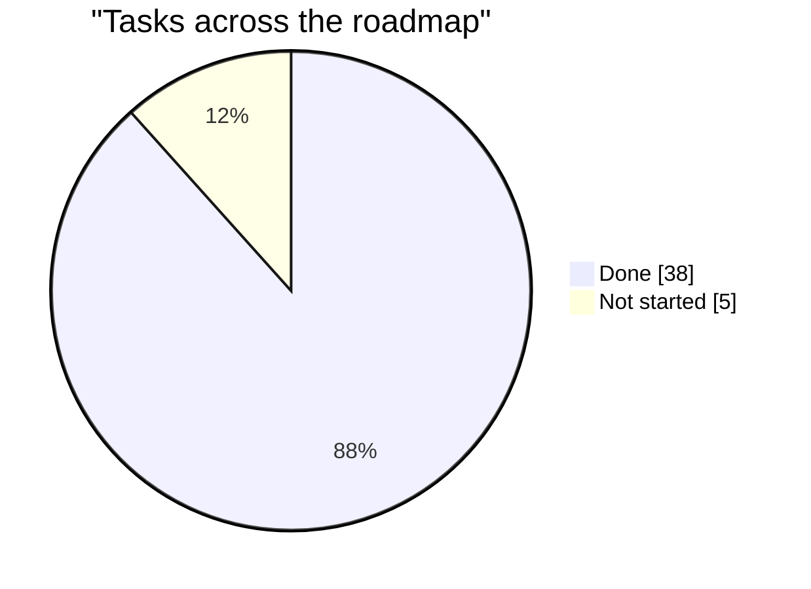

# Project Status

**Generated by `tools/generators/generate_status_report.py` from
`docs/planning/roadmap.md` and the live repository. Do not edit by
hand** -- per root `CLAUDE.md`, generated documentation is never
edited manually, and `make check-status` fails if this file is stale
or if the sources it reads disagree with reality. To change what
appears here, change `docs/planning/roadmap.md`, or fix whatever the
drift check names.

For the richer interactive view (per-task tables, live counts, an
actual generation timestamp), run `make status-report` and open the
dashboard it writes under `build/` -- gitignored, regenerated on
demand, not part of this file.

## Progress

**38/43 tasks complete (88%)** across 14 planned stages. For the full plan, including
stages below not yet broken into tasks: [roadmap.md](roadmap.md).

### Milestones

- **Stage 0 -- Engineering Infrastructure** complete (2026-08-19)
- **Stage 1 -- Representing Space** complete (2026-08-21)
- **Stage 2 -- Representing Fields** complete (2026-08-22)
- **Stage 3 -- Numerical Engine** complete (2026-08-23)
- **Stage 4 -- First Numerical Methods** complete (2026-08-28)
- **Stage 5 -- First Fluid Solver** complete (2026-08-29)

### Up next

**Stage 6 -- Additional Physical Fields** is next, starting with TASK-042 (Field Declaration Configuration), 4 more not yet started in this stage.

## Live repository facts

- **46** `CLAUDE.md` files
- **689** tests collected
- **95** Gherkin scenarios (`tests/features/*.feature`)

## Stages

### Stage 0 -- Engineering Infrastructure

**complete, as of 2026-08-19** -- `██████████` 11/11 tasks; 9/9 criteria met

| Task | Status | Date | Artifact |
|------|--------|------|----------|
| TASK-000 -- Create Engine Skeleton | Done | 2026-08-15 |  |
| TASK-001 -- Development Environment | Done | 2026-08-15 |  |
| TASK-002 -- Build System | Done | 2026-08-15 |  |
| TASK-003 -- Automated Testing | Done | 2026-08-16 |  |
| TASK-004 -- Continuous Integration | Done | 2026-08-19 |  |
| TASK-005 -- Configuration Framework | Done | 2026-08-16 |  |
| TASK-006 -- Logging Framework | Done | 2026-08-16 |  |
| TASK-007 -- Rendering Framework | Done | 2026-08-16 |  |
| TASK-008 -- Repository Documentation | Done |  |  |
| TASK-009 -- CLAUDE.md Hierarchy | Done | 2026-08-19 |  |
| TASK-010 -- Engine Bootstraps | Done | 2026-08-16 |  |

### Stage 1 -- Representing Space

**complete, as of 2026-08-21** -- `██████████` 3/3 tasks; 8/8 criteria met

| Task | Status | Date | Artifact |
|------|--------|------|----------|
| TASK-011 -- Coordinate System | Done | 2026-08-20 | `src/pyflow/engine/coordinate_system.py` |
| TASK-012 | Done | 2026-08-20 | `src/pyflow/engine/mesh.py` |
| TASK-013 | Done | 2026-08-20 | `src/pyflow/rendering/mesh_visualization.py` |

### Stage 2 -- Representing Fields

**complete, as of 2026-08-22** -- `██████████` 5/5 tasks; 9/9 criteria met

| Task | Status | Date | Artifact |
|------|--------|------|----------|
| TASK-014 | Done | 2026-08-21 | `src/pyflow/engine/field.py` |
| TASK-015 | Done | 2026-08-21 | `src/pyflow/engine/collocated_field.py` |
| TASK-016 | Done | 2026-08-21 | `src/pyflow/engine/vector_field.py` |
| TASK-017 | Done | 2026-08-21 | `src/pyflow/rendering/field_visualization.py` |
| TASK-039 | Done | 2026-08-21 | `src/pyflow/configuration/generator.py` |

### Stage 3 -- Numerical Engine

**complete, as of 2026-08-23** -- `██████████` 5/5 tasks; 10/10 criteria met

| Task | Status | Date | Artifact |
|------|--------|------|----------|
| TASK-018 | Done | 2026-08-23 | `src/pyflow/engine/CLAUDE.md` |
| TASK-019 | Done | 2026-08-23 | `tests/unit/numerics/test_boundary_condition_contract.py` |
| TASK-020 | Done | 2026-08-23 | `tests/unit/numerics/test_time_integrator_contract.py` |
| TASK-022 | Done | 2026-08-23 | `tests/unit/test_configuration.py` |
| TASK-021 | Done | 2026-08-23 | `src/pyflow/engine/numerics/pressure_coupling.py` |

### Stage 4 -- First Numerical Methods

**complete, as of 2026-08-28** -- `██████████` 9/9 tasks; 10/10 criteria met

| Task | Status | Date | Artifact |
|------|--------|------|----------|
| TASK-040 | Done | 2026-08-27 | `src/pyflow/engine/simulation.py` |
| TASK-023 | Done | 2026-08-27 | `src/pyflow/engine/numerics/advection.py` |
| TASK-024 | Done | 2026-08-27 | `src/pyflow/engine/numerics/diffusion.py` |
| TASK-025 | Done | 2026-08-27 | `tests/unit/test_rk4_time_integration.py` |
| TASK-026 | Done | 2026-08-27 | `tests/unit/test_conjugate_gradient_solver.py` |
| TASK-027 | Done | 2026-08-27 | `src/pyflow/engine/numerics/pressure_coupling.py` |
| TASK-028 | Done | 2026-08-28 | `src/pyflow/engine/numerics/boundary_condition.py` |
| TASK-029 | Done | 2026-08-28 | `src/pyflow/engine/numerics/boundary_condition.py` |
| TASK-030 | Done | 2026-08-28 | `src/pyflow/engine/mesh.py` |

### Stage 5 -- First Fluid Solver

**complete, as of 2026-08-29** -- `██████████` 5/5 tasks; 13/13 criteria met

| Task | Status | Date | Artifact |
|------|--------|------|----------|
| TASK-041 | Done | 2026-08-28 | `src/pyflow/engine/numerics/assembly.py` |
| TASK-031 | Done | 2026-08-29 | `advection.py` |
| TASK-032 | Done | 2026-08-29 | `src/pyflow/engine/scalar_field.py` |
| TASK-033 | Done | 2026-08-29 | `PressureCoupling.correct` |
| TASK-034 | Done | 2026-08-29 | `tests/features/navier_stokes_timestep.feature` |

### Stage 6 -- Additional Physical Fields

**no status recorded** -- `░░░░░░░░░░` 0/5 tasks; 12 criteria defined, no status line yet

| Task | Status | Date | Artifact |
|------|--------|------|----------|
| TASK-042 -- Field Declaration Configuration | Not started |  |  |
| TASK-035 -- Temperature | Not started |  |  |
| TASK-036 -- Density | Not started |  |  |
| TASK-037 -- Humidity | Not started |  |  |
| TASK-038 -- Passive Tracers | Not started |  |  |

### Stage 7 -- Better Numerics

**no status recorded** -- not yet broken into tasks; 0 criteria defined, no status line yet

### Stage 8 -- Geometry

**no status recorded** -- not yet broken into tasks; 0 criteria defined, no status line yet

### Stage 9 -- Adaptive Resolution

**no status recorded** -- not yet broken into tasks; 0 criteria defined, no status line yet

### Stage 10 -- Additional Numerical Frameworks

**no status recorded** -- not yet broken into tasks; 0 criteria defined, no status line yet

### Stage 11 -- Three Dimensions

**no status recorded** -- not yet broken into tasks; 0 criteria defined, no status line yet

### Stage 12 -- Performance

**no status recorded** -- not yet broken into tasks; 0 criteria defined, no status line yet

### Stage 13 -- Advanced Physics

**no status recorded** -- not yet broken into tasks; 0 criteria defined, no status line yet

## About this snapshot

This file is current as of when it was last regenerated and
committed -- run `git log -1 docs/planning/status.md` for exactly
when. No generation timestamp is embedded in this file itself: it's
committed and `--check`-gated, so a wall-clock stamp would make it
go stale the instant time passed, for no real reason. For the
state right now, run `make status-report` and open the dashboard
under `build/` -- it stamps its own generation time, because
nothing checks it.
